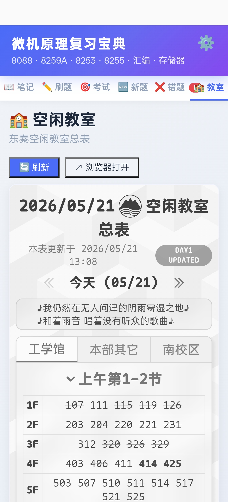
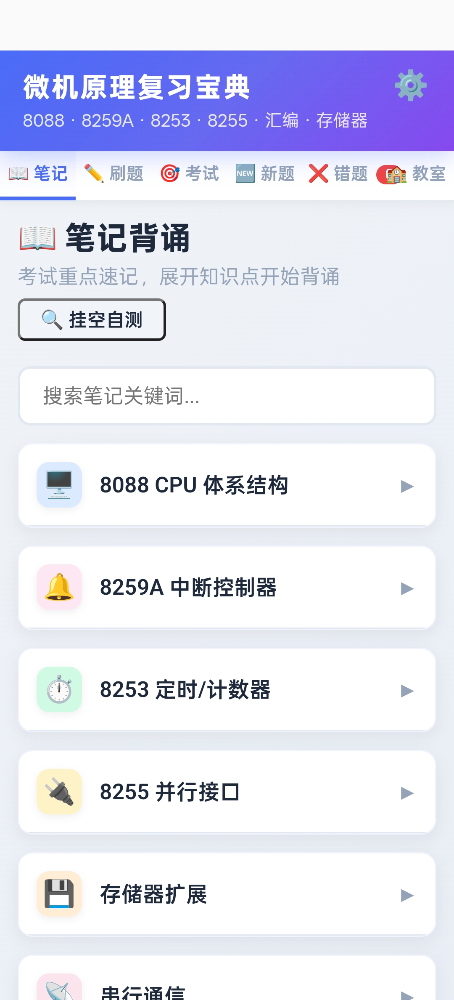
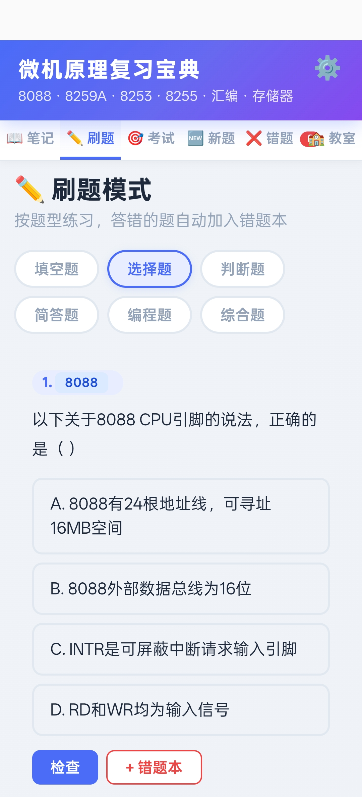

# 微机原理复习宝典

东秦微机原理考试复习 App — 笔记背诵、刷题练习、模拟考试、AI 批改、空闲教室查询

## 功能

| 功能 | 说明 |
|------|------|
| 📖 **笔记背诵** | 分章节知识点卡片，点击遮罩自测 |
| ✏️ **刷题练习** | 选择题、填空、判断、编程、综合五大题型 |
| 🎯 **模拟考试** | 选题型+数量，限时作答，自动评分 |
| 🤖 **DeepSeek AI 批改** | 生成新题后可调用 AI 批改并讲解选项对比 |
| 🆕 **新题生成** | 从题库池随机抽题，AI 辅助批改 |
| ❌ **错题本** | 自动收录错题，重练+3次正确可移除 |
| 🏫 **空闲教室** | 集成东秦空闲教室总表，实时查询 |

## 截图

| 空闲教室 | 笔记背诵 | 刷题模式 |
|:---:|:---:|:---:|
|  |  |  |

| 模拟考试 | 新题生成 | 错题本 |
|:---:|:---:|:---:|
|  |  |  |

## 技术栈

- **前端**: 纯 HTML + CSS + JavaScript（单页应用）
- **容器**: Capacitor 8 → Android APK
- **AI**: DeepSeek Chat API（选配）
- **数据**: 本地题库 + localStorage 持久化

## 构建

```bash
npm install
npx cap sync
cd android
./gradlew assembleDebug
```

APK 产物：`android/app/build/outputs/apk/debug/*.apk`

## 许可

MIT
